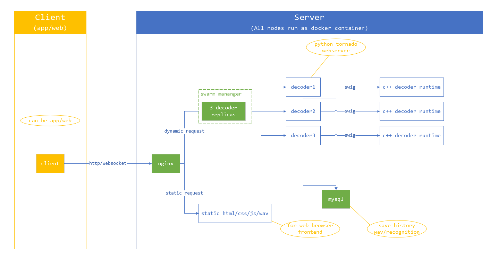

# X Decoder

XDecoder is a light ASR(Automatic Speech Recognition) decoder framework. 
X means enchanced, fast, and portable. Our target is running 
LVCSR(Large Vocabulary Continuous Speech Recognition) on low resourse system,
especially on mobile phones and other embedding device. 

So serveral things should be taken into account.

- **Mini**, the whole package(AM, LM, lib) of the system should be small.
- **Fast**, Recognition speed should be in real time
- **Low power**, which is critical for modern mobile phones.

I make my mind to make XDecoder to support ASR service as well, and ASR service
is the first priority now.

## X Decoder Server Design



## Docker Deploy

- Install docker and docker compose tools: https://docs.docker.com/install/

- Clone xdecoder code

    ``` sh
    git clone https://github.com/robin1001/xdecoder.git
    ```

- Prepare all config files, copy it to ./config
    - decoder related files: am net, am cmvn, hclg, tree, pdf_prior, words.txt, vad net, vad cmvn 
    - config files for runtime: xdecoder.json

- Build docker image
    ``` sh
    docker build -t xdecoder .
    ```
- Run servie by docker swarm
    ``` sh
    docker stack deploy -c docker-compose.yml xdecoder_service
    ```

## News
- 2018-07-09 xdecoder server swarm works, add design
- 2018-06-27 make decision to make XDecoder support ASR service, and ASR service will be the P0 priority
- 2018-06-20 xdecode offline tool works
- 2018-05-23 Add fft, fbank, feature pipeline
- 2018-05-22 Add net inference
- 2018-04-22 Add fst and corresponding tools
- 2018-04-10 Add varint support

## Solutions

This is our solutions for the above requirements.

### Mini
1. AM, we will use quantizaton to reduce the model. The model size can be reduced to 1/4 if we use 8 bits quantization. And we can use SVD to compress the model further.
2. LM, LM here means the decoding FST file. Small LM should be used in our scenario. The basic unit of FST is arc,
which is a tuple(ilabel, olabel, weight, next\_state) with four elements in nature. And ilabel, olabel, next\_state are int32 type, 
so we can use varint to reduce it.
3. lib, the third party library should be as less as possible.

### Fast


## eXperiments

### Mini

#### LM, HCLG compression
    
Xdecoders HCLG fst file is converted from kaldi HCLG openfst file. Here is a comparison of kaldi openfst file, xdecoder before/after varint compression.
The kaldi HCLG is from aishell's decoding HCLG, which has 3482984 states and 8543232 arcs.

| HCLG FST File               | Size |
|-----------------------------|------|
| kaldi openfst               | 197M |
| xdecoder fst(before varint) | 144M |
| xdecoder fst(after varint)  | 100M |

We can see the for this HCLG, the final xdecoder varint fst is only half of the kaldi openfst file.
Compared with the xdecoder fst before varint, the xdecoder fst after varint cut off 44M file size, the compression ratio is 69%.
I think we can get much bigger compression rate if the original fst is smaller.

Another example is the transition id to pdf file, which has 4519 transitions and 2145 pdfs.
We can see more than half compression rate after we use varint since all of the pdf ids are small integers.

| Transition Id to Pdf File           | Size  |
|-------------------------------------|-------|
| transition id to pdf(before varint) | 18080 |
| transition id to pdf(after varint)  | 8879  |

### Decoder ###
| Decoder                     | CER   |
|-----------------------------|-------|
| faster decoder              | 19.00 |
| lattice faster decoder      | 16.33 |

